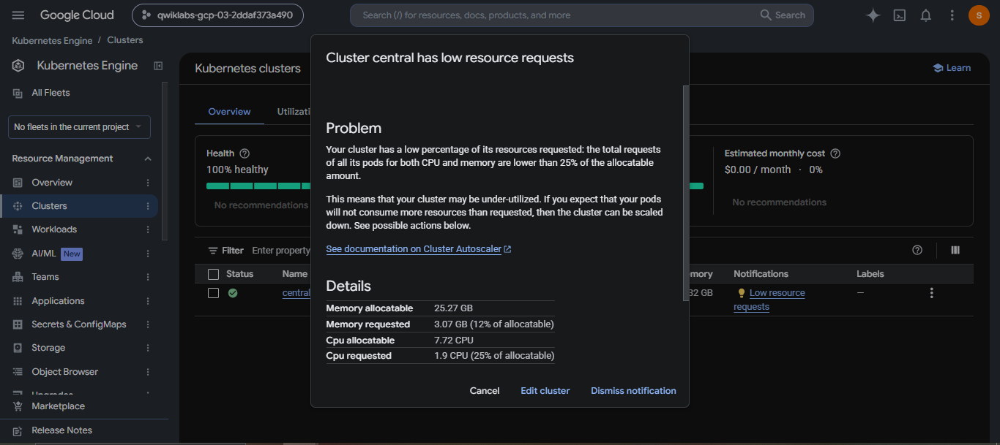

# Debug Apps on Google Kubernetes Engine

A comprehensive Site Reliability Engineering (SRE) and DevOps portfolio document detailing hands-on incident response, telemetry configuration, root-cause investigation, and configuration-based remediation for a microservices application running on Google Kubernetes Engine (GKE).

## Lab Information

| Field | Details |
|---|---|
| Lab | Debug Apps on Google Kubernetes Engine |
| Lab ID | GSP736 |
| Platform | Google Cloud |
| Difficulty | Intermediate |
| Duration | 20 minutes |
| Credits | 5 |
| Status | Completed |

## Overview

This lab demonstrates how to troubleshoot and remediate real-world application failures on Google Kubernetes Engine (GKE) using native Google Cloud observability tools. The scenario involved deploying Google Cloud's 11-service Online Boutique microservices application, creating a custom logs-based metric (`Error_Rate_SLI`) in Cloud Logging to capture application-level HTTP 500 errors, and establishing a Cloud Monitoring alerting policy.

Under simulated user traffic generated by Locust, an intentional memory leak and pod crash loop caused by a catalog reloading configuration (`ENABLE_RELOAD`) triggered `ProductCatalogService` to fail continuously under load. Using a systematic Site Reliability Engineering (SRE) workflow—moving from alert receipt to log correlation, workload pod status inspection, and container log analysis—the root cause was identified, remediated via Kubernetes manifest modification, redeployed, and verified to ensure complete application recovery.

## Troubleshooting Flow

```text
Application Traffic (Locust Load Generator)
        ↓
Online Boutique on GKE (Frontend Gateway)
        ↓
Application Errors (HTTP 500 Responses)
        ↓
Cloud Monitoring Alert (Error_Rate_SLI Threshold)
        ↓
Cloud Logging Investigation (Traceback Correlation)
        ↓
Identify ProductCatalogService (Downstream Dependency)
        ↓
Inspect Workload + Logs (CrashLoopBackOff & Container Output)
        ↓
Find ENABLE_RELOAD (Environment Variable in Manifest)
        ↓
Remove Configuration (Edit deployment YAML)
        ↓
Redeploy (kubectl apply -f release/kubernetes-manifests.yaml)
        ↓
Verify Recovery (0% Error Rate & Pod Stability under Load)
```

The troubleshooting flow outlines the incident lifecycle: traffic spikes produce application errors filtered into a custom Cloud Logging metric. Crossing the metric threshold triggers a Cloud Monitoring alert. Investigation traces errors from `RecommendationService` back to recurring pod crashes in `ProductCatalogService`. Container log analysis reveals continuous catalog JSON parsing driven by `ENABLE_RELOAD="1"`. Stripping this environment variable and reapplying the deployment stabilizes pod memory consumption and restores 100% request success.

---

## SLI / SLO Engineering Mathematics

In SRE practice, Service Level Indicators (SLIs) and Service Level Objectives (SLOs) quantify application reliability:

### 1. Availability SLI Formula
The Availability SLI measures the percentage of successful user requests served over a given window:

$$\text{SLI}_{\text{availability}} = \left( \frac{\text{Total HTTP Requests} - \text{HTTP 500 Error Responses}}{\text{Total HTTP Requests}} \right) \times 100\%$$

During the failure state induced by `ENABLE_RELOAD="1"`, `ProductCatalogService` crashes caused the frontend to return HTTP 500 errors, dropping $\text{SLI}_{\text{availability}}$ well below the target baseline ($99.9\%$).

### 2. Error Budget Burn Rate Formula
Error budget burn rate indicates how fast an incident consumes the allowed downtime:

$$\text{Burn Rate} = \frac{\text{Observed Error Rate}}{\text{Allowed Error Rate}}$$

When the custom Cloud Logging metric `logging/user/Error_Rate_SLI` breached the alert threshold, the rapid burn rate mandated immediate SRE triage and remediation.

---

## Production SRE Deep-Dive: Anti-Pattern & Remediation

### The Root Cause Anti-Pattern: `ENABLE_RELOAD="1"`
In Go / gRPC container microservices, enabling synchronous file-reloading on every API invocation creates several severe production failure modes:

1. **CPU & Memory Exhaustion**: Repeatedly parsing static JSON/YAML disk files forces continuous heap allocations, triggering Go Garbage Collection (GC) thrashing and high CPU utilization.
2. **Pod OOMKilled & CrashLoopBackOff**: Under high concurrency (e.g. Locust load test), memory usage spikes beyond container memory limits, causing the Linux Kernel OOM killer to terminate the container process (`Exit Code 137`).
3. **Cascading Microservice Failures**: Upstream services (`RecommendationService` and `Frontend`) experience RPC context timeouts and connection refusals, returning HTTP 500 errors to end users.

### Real-World Production Alternatives to `ENABLE_RELOAD`
In enterprise production Kubernetes environments, dynamic configuration updates are managed without application file reloading:

- **ConfigMap Hot-Reloading via Sidecars**: Use lightweight sidecar tools (e.g., `kiwigrid/k8s-sidecar` or Prometheus `--web.enable-lifecycle`) to trigger SIGHUP reloads only when ConfigMaps actually change.
- **Kubernetes Operator Pattern**: Implement Kubernetes controllers (e.g., Stakater Reloader) that detect ConfigMap/Secret changes and trigger zero-downtime rolling updates.
- **GitOps Continuous Deployment**: Manage all configuration updates as Git commits synced automatically via ArgoCD or FluxCD.

---

## Advanced Kubernetes Debugging Cheatsheet

Below is a cheat sheet of SRE commands used during pod crash investigations:

```bash
# 1. Check pod status, restart counts, and status reasons
kubectl get pods -n default -o wide

# 2. Inspect detailed container events, OOMKilled status, and resource limits
kubectl describe pod -l app=productcatalogservice

# 3. Stream container stdout/stderr logs with timestamps
kubectl logs -l app=productcatalogservice --all-containers=true --tail=100 -f --timestamps

# 4. View logs from previous crashed container instance (crucial for CrashLoopBackOff)
kubectl logs -l app=productcatalogservice --previous

# 5. Check real-time CPU and Memory resource consumption across pods
kubectl top pods --containers

# 6. Locate specific environment variables inside deployment YAML
kubectl get deployment productcatalogservice -o yaml | grep -i reload
```

---

## What I Practiced

- **GKE Cluster Diagnostics**: Verified cluster status, node health, and credentials using `gcloud container clusters` and `kubectl get nodes`.
- **Microservices Deployment**: Launched 11 interconnected microservices using multi-document Kubernetes YAML manifests.
- **Custom Telemetry Configuration**: Created Cloud Logging log filters and user-defined logs-based metrics (`logging/user/Error_Rate_SLI`).
- **Proactive Alerting**: Configured Cloud Monitoring alerting policies with customized threshold parameters.
- **Synthetic Load Testing**: Induced application stress and error conditions using the Locust load generator.
- **Log Correlation & Root-Cause Isolation**: Traced cascading microservices errors across stack traces to locate failing pod workloads.
- **Kubernetes Workload Diagnostics**: Analyzed pod restart counts, container exit codes, and stdout streams.
- **Configuration Remediation**: Stripped bad runtime configuration (`ENABLE_RELOAD`) from deployment manifests.
- **Rolling Redeployment & Post-Fix Validation**: Reapplied manifests via `kubectl apply` and verified error elimination under load.

## Lab Tasks

### 1. GKE Infrastructure Setup

Verified the operational health and node configuration of the pre-provisioned GKE cluster named `central` located in zone `us-east4-b`. Generated local `kubeconfig` credentials via `gcloud` and confirmed that all 4 worker nodes were in the `Ready` state.




### 2. Deploy Microservices Application

Cloned the microservices demo repository and deployed the Online Boutique application stack (11 microservices including Frontend, Cart, Checkout, Currency, Payment, Product Catalog, Recommendation, Shipping, Ad, Email, and Redis Cache) using `kubectl apply`.


### 3. Application Verification

Fetched the external LoadBalancer IP address for `frontend-external` and confirmed browser access to the live Online Boutique e-commerce platform.


### 4. Create Logs-Based Metric

In Cloud Logging, created a custom logs-based metric named `logging/user/Error_Rate_SLI` filtered to log entries containing container HTTP 500 error messages to measure application failure rates.

### 5. Create Monitoring Alert

Built a Cloud Monitoring alerting policy utilizing the `Error_Rate_SLI` metric to automatically trigger incident notifications when the container error rate exceeded the defined threshold.


### 6. Trigger Application Failure

Executed synthetic traffic generation using Locust. Under increased request volume, application error rates spiked, causing HTTP 500 errors to propagate across the microservices mesh and triggering the Monitoring alert.

### 7. Investigate the Root Cause

Executed SRE incident triage:
1. **Alert Acknowledgement**: Received notification of elevated `Error_Rate_SLI` in Cloud Monitoring.
2. **Log Exploration**: Searched Cloud Logging for HTTP 500 tracebacks. Discovered `RecommendationService` throwing errors when attempting to query product catalog details.
3. **Workload Inspection**: Checked pod status via `kubectl get pods` and GKE Console. Discovered `ProductCatalogService` pods entering `CrashLoopBackOff` with high restart counts.
4. **Container Log Diagnostics**: Inspected container stdout for `ProductCatalogService`, identifying continuous re-parsing of the product catalog JSON file on every request, leading to memory exhaustion and crash loops.

### 8. Identify ENABLE_RELOAD

Inspected the Kubernetes manifest environment variables for `ProductCatalogService` and located `ENABLE_RELOAD="1"`. This setting forced the container to reload and re-parse the catalog file on every incoming API request, causing memory overload under load.

### 9. Remove ENABLE_RELOAD & Apply the Fix

Edited the Kubernetes deployment manifest to delete the `ENABLE_RELOAD` environment variable declaration and reapplied the manifest to GKE.

#### Lab Commands
```bash
# Locate ENABLE_RELOAD in the manifests file
grep -A1 -ni ENABLE_RELOAD release/kubernetes-manifests.yaml

# Remove the ENABLE_RELOAD environment variable block
sed -i -e '373,374d' release/kubernetes-manifests.yaml

# Reapply the updated manifest to GKE
kubectl apply -f release/kubernetes-manifests.yaml
```

### 10. Verify the Fix

After manifest re-application:
- GKE executed a smooth rolling update of the `ProductCatalogService` deployment.
- Pod crash loops stopped and pod restart counters stabilized.
- Continuous catalog parsing log entries disappeared from container stdout.
- Locust load testing verified that HTTP 500 response rates dropped to 0%.
- Resetting load-generator statistics confirmed 100% request success under load.

## Screenshots / Evidence

The lab evidence is mapped below using professional portfolio classifications corresponding to the actual screenshot files in the repository:

| Evidence Classification | File Reference | What it Demonstrates |
|---|---|---|
| `01-online-boutique-architecture.png` | [`Debug app on kub.png`](Screenshot/Debug%20app%20on%20kub.png) | Microservices architecture diagram showing service connections across Online Boutique components |
| `02-gke-cluster-validation.png` | [`Screenshot 2026-08-31 222422.png`](Screenshot/Screenshot%202026-08-31%20222422.png) | Cloud Shell terminal running `gcloud` cluster listing and confirming 4 nodes in `Ready` state |
| `03-gke-cluster-health-overview.png` | [`image.png`](Screenshot/image.png) | GKE Console Cluster Overview showing 100% cluster health, memory allocatable (25.27 GB), and CPU metrics |
| `04-microservices-manifest-deployment.png` | [`image copy.png`](Screenshot/image%20copy.png) | Executing `git clone` and `kubectl apply` to launch the 11 microservices workloads |
| `05-gke-workloads-running.png` | [`image copy 2.png`](Screenshot/image%20copy%202.png) | GKE Workloads Console displaying all 11 microservice deployments running with status `OK` |
| `06-online-boutique-frontend.png` | [`image copy 3.png`](Screenshot/image%20copy%203.png) | Live Online Boutique storefront web page loaded via External LoadBalancer IP (`8.234.132.37`) |
| `07-error-rate-sli-metric-alert.png` | [`image copy 4.png`](Screenshot/image%20copy%204.png) | Cloud Monitoring UI configuring an alerting policy on the custom `logging/user/Error_Rate_SLI` metric |
| `08-cloud-monitoring-dashboard.png` | [`image copy 5.png`](Screenshot/image%20copy%205.png) | Cloud Monitoring Overview dashboard presenting fleet telemetry visualizations and monitoring scopes |

## Key Technical Concepts

### GKE
Google Kubernetes Engine provides managed Kubernetes infrastructure, container orchestration, automated scaling, and integration with GCP native telemetry services.

### Cloud Logging
Real-time log management service for collecting, filtering, and analyzing stdout/stderr streams across GKE containers and cluster components.

### Cloud Monitoring
Infrastructure and application performance monitoring platform providing custom metric storage, visualization dashboards, and incident alerting.

### Logs-Based Metrics
User-defined Cloud Monitoring metrics derived from matching log filter patterns in Cloud Logging, bridging application log output with quantitative numerical metrics.

### Alerting
Automated policy evaluation framework that triggers notifications when metrics violate defined thresholds, enabling proactive incident management.

### Kubernetes Workloads
High-level abstractions (Deployments, ReplicaSets, Pods) managing containerized application lifecycles and self-healing behaviors on GKE.

### Root-Cause Analysis
The process of isolating foundational system or application defects through log correlation, metric analysis, and dependency tracing.

### Configuration-Based Remediation
Resolving application instability by modifying runtime environment parameters or manifest specifications without altering application source code.

## Troubleshooting Methodology

The lab followed a structured SRE incident lifecycle:

1. **Detect**: Automated capture of HTTP 500 errors via Cloud Logging log filters.
2. **Alert**: Automated alert generation in Cloud Monitoring when `Error_Rate_SLI` crossed the threshold.
3. **Investigate**: Traceback analysis across microservices starting from frontend and gateway errors.
4. **Narrow Scope**: Correlate upstream failures (`RecommendationService`) to pod restart loops in `ProductCatalogService`.
5. **Identify Root Cause**: Extract container stdout to discover catalog file re-parsing driven by `ENABLE_RELOAD`.
6. **Apply Remediation**: Remove `ENABLE_RELOAD` from `release/kubernetes-manifests.yaml`.
7. **Redeploy**: Reapply the deployment manifest to trigger a clean rolling update.
8. **Verify Recovery**: Confirm pod stability, log normalization, and 0% failure rate under load.

## Tools & Technologies

| Category | Technology |
|---|---|
| Cloud | Google Cloud Platform (GCP) |
| Containers | Docker |
| Orchestration | Google Kubernetes Engine (GKE) |
| Kubernetes CLI | `kubectl` |
| Logging | Cloud Logging |
| Monitoring | Cloud Monitoring |
| Metrics | Logs-based metrics |
| Alerting | Cloud Monitoring Alerting Policies |
| Load Testing | Locust |
| Configuration | Kubernetes Manifests (YAML) |
| Shell | Google Cloud Shell |

## What I Learned

- How to construct custom logs-based metrics in Cloud Logging to transform unstructured error logs into quantitative telemetry.
- How to set up Cloud Monitoring alerting policies based on custom application SLIs to catch issues before users report them.
- How microservices failures cascade across inter-service calls, causing downstream services to report errors while the true root cause lies elsewhere.
- How to diagnose GKE pod crash loops (`CrashLoopBackOff`) using `kubectl get pods`, `kubectl describe`, and container logs.
- How un-optimized application configuration flags (like continuous file reloading) can exhaust memory and crash pods under concurrent load.
- How to safely remediate Kubernetes deployment manifests and trigger rolling updates to apply fixes.
- How to validate post-fix system stability using synthetic traffic generators to guarantee recovery under load.

## Portfolio Relevance

This lab demonstrates practical experience in:
- **Cloud Engineering**: Provisioning, verifying, and maintaining containerized applications on GKE.
- **DevOps Engineering**: Deploying multi-container Kubernetes manifests, modifying release specs, and automating rollouts.
- **Site Reliability Engineering (SRE)**: Implementing SLIs/SLOs via logs-based metrics, establishing alerting pipelines, and performing root-cause incident triage.
- **Platform Engineering**: Managing GKE cluster health, resource requests, and workload observability.

## Evidence & Integrity

- Documentation is strictly based on the completed Google Cloud Arcade lab **Debug Apps on Google Kubernetes Engine** (`GSP736`).
- All 8 screenshots included in `Screenshot/` serve as direct empirical evidence of lab execution.
- No production secrets, project credentials, or private infrastructure data are disclosed.
- Executed within a sandboxed, temporary Google Cloud Qwiklabs environment.

## Completion

Lab: Debug Apps on Google Kubernetes Engine  
Lab ID: GSP736  
Status: Completed
