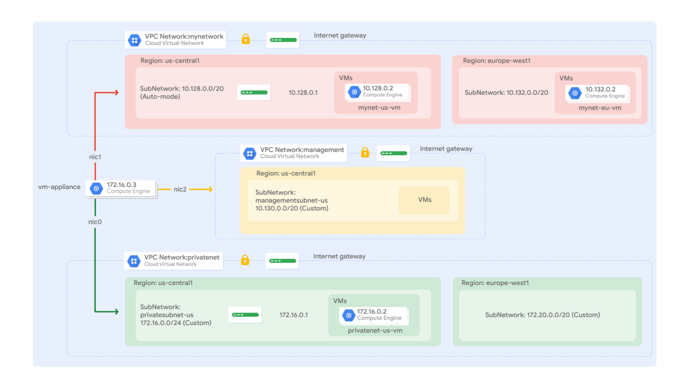
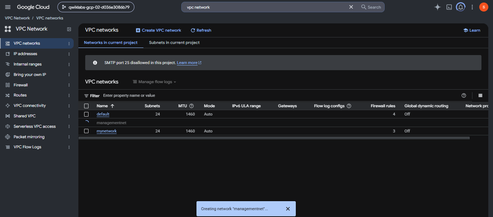
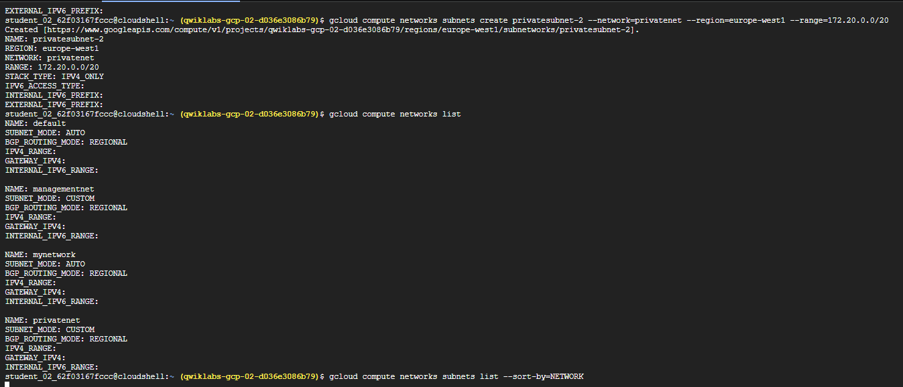
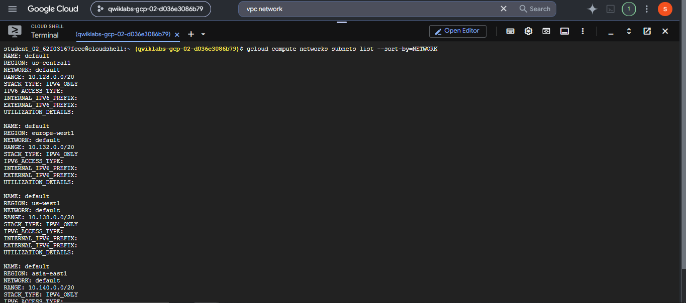
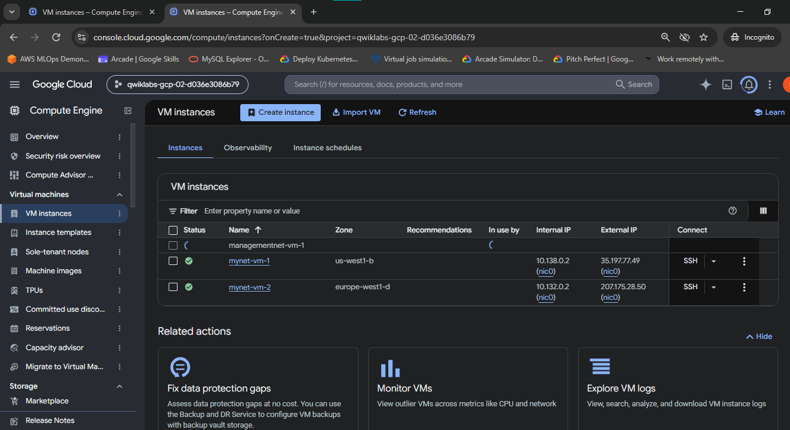
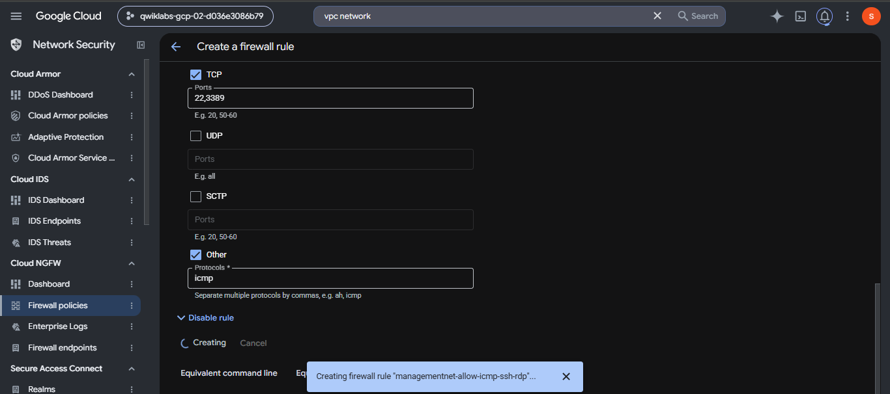
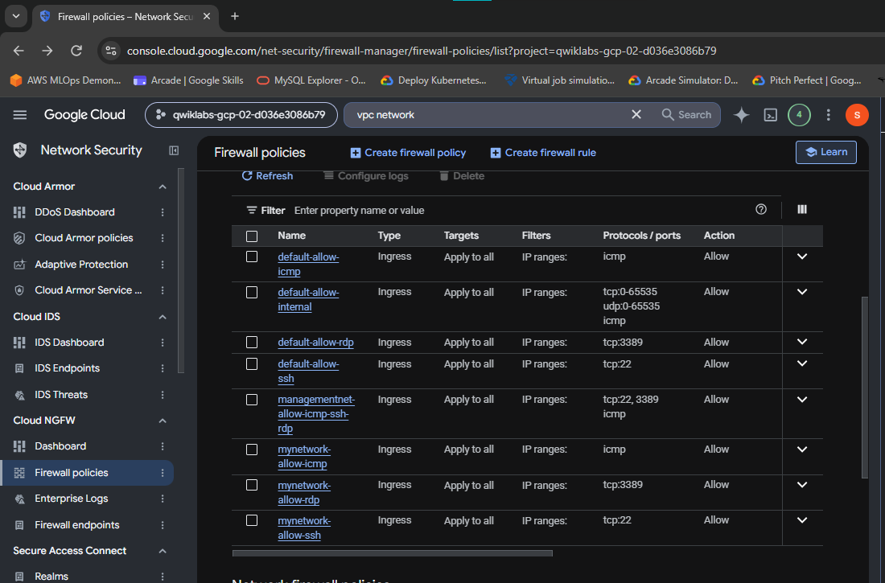
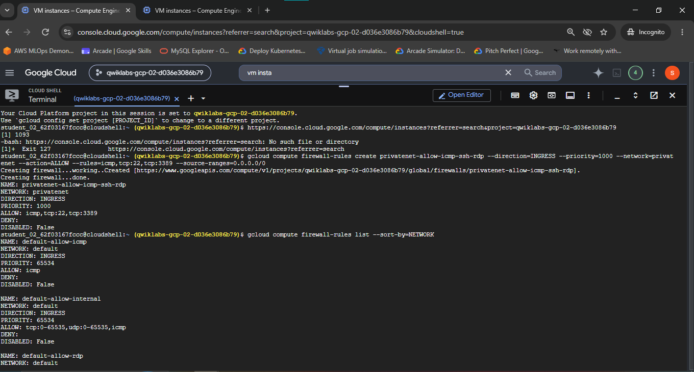
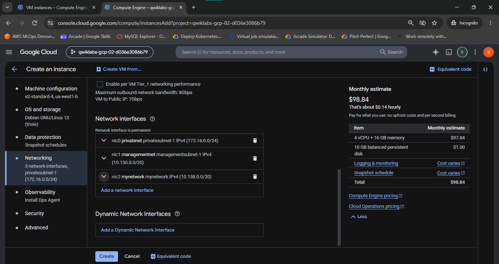

# Multiple VPC Networks

A comprehensive Google Cloud Networking & DevOps portfolio document detailing custom-mode VPC creation, multi-subnet architecture, firewall policy configuration, VM instance provisioning, cross-VPC network isolation, multi-network interface (Multi-NIC) appliance design, Linux interface triage (`ifconfig`), and kernel routing table analysis (`ip route`).

## Lab Information

| Field | Details |
|---|---|
| Lab | Multiple VPC Networks |
| Lab ID | GSP211 |
| Platform | Google Cloud |
| Difficulty | Intermediate |
| Duration | 25 minutes |
| Cost | Free / No Cost |
| Status | Completed |
| Score | 100 / 100 |

## Overview

Google Cloud Virtual Private Cloud (VPC) networks provide networking functionality for Compute Engine VM instances, GKE clusters, and enterprise cloud workloads. By default, Google Cloud projects contain an `auto-mode` VPC network named `default`. However, production DevOps and enterprise cloud environments require custom-mode VPC topologies with strict subnet boundary isolation, custom firewall rules, and explicit routing control.

This lab demonstrates the end-to-end design, construction, and validation of a multi-VPC cloud architecture on Google Cloud. Two custom-mode VPC networks (`managementnet` and `privatenet`) were provisioned alongside the existing `mynetwork` VPC. Custom subnets (`managementsubnet-1`, `privatesubnet-1`, `privatesubnet-2`) were allocated across `us-west1` and `europe-west1` regions, and targeted firewall policies were configured to permit ICMP, SSH (TCP 22), and RDP (TCP 3389) traffic.

To demonstrate VPC network isolation and multi-network attachment, Compute Engine instances were deployed into isolated subnets (`managementnet-vm-1`, `privatenet-vm-1`). Furthermore, a multi-NIC VM appliance (`vm-appliance`) was provisioned with three distinct network interfaces (`eth0`, `eth1`, `eth2`) attached simultaneously to `privatenet`, `managementnet`, and `mynetwork`. Through Linux networking tools (`ifconfig`, `ip route`, `ping`), cross-VPC isolation, internal/external IP reachability, and asymmetric kernel routing behaviors were rigorously analyzed and verified.

## Network Architecture

```text
                                  Google Cloud Project
                                           |
         +---------------------------------+---------------------------------+
         |                                 |                                 |
    mynetwork                        managementnet                       privatenet
   (Auto-mode)                       (Custom-mode)                      (Custom-mode)
         |                                 |                                 |
   +-----+-----+                   +-------+-------+                 +-------+-------+
   |           |                   |               |                 |               |
mynet-vm-1  mynet-vm-2     managementsubnet-1  managementnet-vm-1  privatesubnet-1  privatesubnet-2
(us-west1) (europe-west1)  (10.130.0.0/20)    (us-west1)        (172.16.0.0/24) (172.20.0.0/20)
                                   |                                 |               |
                                   |                                 |        privatenet-vm-1
                                   |                                 |           (us-west1)
                                   \               |                 /
                                    \              |                /
                                     +-------------+---------------+
                                                   |
                                             vm-appliance
                                           (Multi-NIC VM)
                                          /        |        \
                                       eth0      eth1      eth2
                                        |          |        |
                                   privatenet management mynetwork
```



The architecture diagram highlights the separation between the three VPC networks (`mynetwork`, `managementnet`, and `privatenet`). Compute instances inside individual VPCs remain completely isolated at Layer 3 unless multi-homed via a multi-NIC VM appliance or connected via VPC Peering or Cloud VPN.

---

## Subnetting Mathematics & IP Addressing

In Google Cloud VPC networking, CIDR (Classless Inter-Domain Routing) notation defines the internal IP address space allocated to each subnet. Google Cloud reserves 4 IP addresses in every subnet (the network address, default gateway address, and the last two addresses in the range for broadcast/future reservation).

### 1. Usable Host IPv4 Allocation Formula
The number of available IP addresses for Compute Engine instances in a given subnet is calculated as:

$$\text{Usable IPs} = 2^{(32 - n)} - 4$$

Where $n$ represents the CIDR prefix length.

### 2. Subnet Range Calculations

#### Subnet 1: `managementsubnet-1` (`10.130.0.0/20`)
- **Prefix Length ($n$)**: `/20` (Subnet Mask: `255.255.240.0`)
- **Total IP Addresses**: $2^{(32 - 20)} = 2^{12} = 4,096$
- **Reserved IPs**: $4$ (Network `10.130.0.0`, Gateway `10.130.0.1`, Reserved `10.130.15.254`, `10.130.15.255`)
- **Usable Host Capacity**: $4,096 - 4 = 4,092$ usable IPv4 addresses.
- **IP Address Range**: `10.130.0.0` – `10.130.15.255`

#### Subnet 2: `privatesubnet-1` (`172.16.0.0/24`)
- **Prefix Length ($n$)**: `/24` (Subnet Mask: `255.255.255.0`)
- **Total IP Addresses**: $2^{(32 - 24)} = 2^{8} = 256$
- **Reserved IPs**: $4$ (Network `172.16.0.0`, Gateway `172.16.0.1`, Reserved `172.16.0.254`, `172.16.0.255`)
- **Usable Host Capacity**: $256 - 4 = 252$ usable IPv4 addresses.
- **IP Address Range**: `172.16.0.0` – `172.16.0.255`

#### Subnet 3: `privatesubnet-2` (`172.20.0.0/20`)
- **Prefix Length ($n$)**: `/20` (Subnet Mask: `255.255.240.0`)
- **Total IP Addresses**: $2^{(32 - 20)} = 2^{12} = 4,096$
- **Usable Host Capacity**: $4,096 - 4 = 4,092$ usable IPv4 addresses.
- **IP Address Range**: `172.20.0.0` – `172.20.15.255`

---

## Network & VM Instance Topology

### VPC Networks & Subnets Configuration

| VPC Network | Subnet Mode | Subnet Name | Region | CIDR Block | Gateway IP | Usable IPs |
|---|---|---|---|---|---|---|
| `managementnet` | Custom | `managementsubnet-1` | `us-west1` | `10.130.0.0/20` | `10.130.0.1` | 4,092 |
| `privatenet` | Custom | `privatesubnet-1` | `us-west1` | `172.16.0.0/24` | `172.16.0.1` | 252 |
| `privatenet` | Custom | `privatesubnet-2` | `europe-west1` | `172.20.0.0/20` | `172.20.0.1` | 4,092 |
| `mynetwork` | Auto | Auto-generated (24 subnets) | Global (All regions) | `10.128.0.0/9` regional ranges | Various | ~4,092 / region |







### Provisioned VM Instances Topology

| VM Instance Name | Primary VPC Network | Subnet | Zone | Internal IP Example | Multi-NIC Attached Networks |
|---|---|---|---|---|---|
| `managementnet-vm-1` | `managementnet` | `managementsubnet-1` | `us-west1-b` | `10.130.0.2` | Single-NIC (`nic0` only) |
| `privatenet-vm-1` | `privatenet` | `privatesubnet-1` | `us-west1-b` | `172.16.0.2` | Single-NIC (`nic0` only) |
| `mynet-vm-1` | `mynetwork` | `mynetwork` (`us-west1`) | `us-west1-b` | `10.138.0.2` | Single-NIC (`nic0` only) |
| `mynet-vm-2` | `mynetwork` | `mynetwork` (`europe-west1`)| `europe-west1-d`| `10.132.0.2` | Single-NIC (`nic0` only) |
| `vm-appliance` | `privatenet` | `privatesubnet-1` | `us-west1-b` | `172.16.0.3` | **Multi-NIC** (`eth0`: `privatenet`, `eth1`: `managementnet`, `eth2`: `mynetwork`) |



---

## Firewall Configuration

In Google Cloud VPC networks, an implicit ingress deny rule blocks all incoming traffic to VM instances unless explicitly allowed by firewall rules. In custom-mode networks, ingress rules must be defined to permit SSH, RDP, and ICMP monitoring.

| Rule Name | VPC Network | Direction | Priority | Action | Allowed Protocols & Ports | Source Range | Purpose |
|---|---|---|---|---|---|---|---|
| `managementnet-allow-icmp-ssh-rdp` | `managementnet` | Ingress | 1000 | ALLOW | `icmp`, `tcp:22`, `tcp:3389` | `0.0.0.0/0` | Enables SSH management, RDP, and ICMP ping diagnostics for `managementnet` |
| `privatenet-allow-icmp-ssh-rdp` | `privatenet` | Ingress | 1000 | ALLOW | `icmp`, `tcp:22`, `tcp:3389` | `0.0.0.0/0` | Enables SSH management, RDP, and ICMP ping diagnostics for `privatenet` |
| `mynetwork-allow-icmp` | `mynetwork` | Ingress | 1000 | ALLOW | `icmp` | `0.0.0.0/0` | Default firewall rule permitting ping diagnostic traffic in `mynetwork` |
| `mynetwork-allow-ssh` | `mynetwork` | Ingress | 1000 | ALLOW | `tcp:22` | `0.0.0.0/0` | Default firewall rule permitting SSH connection to instances in `mynetwork` |







---

## Multi-NIC Routing & Interface Analysis

A Compute Engine VM instance can have multiple virtual network interfaces (NICs) attached to different VPC networks. However, each NIC must be connected to a separate VPC network.

### Interface Mapping on `vm-appliance`

| Linux Interface | Attached VPC Network | Assigned Subnet | Primary Internal IP | Gateway Router IP |
|---|---|---|---|---|
| `eth0` | `privatenet` | `privatesubnet-1` (`us-west1`) | `172.16.0.3` | `172.16.0.1` |
| `eth1` | `managementnet` | `managementsubnet-1` (`us-west1`) | `10.130.0.3` | `10.130.0.1` |
| `eth2` | `mynetwork` | `mynetwork` (`us-west1`) | `10.138.0.3` | `10.138.0.1` |



### Kernel Routing Table (`ip route`) Breakdown

When `vm-appliance` boots, the Linux kernel auto-configures its routing table based on the primary network interface (`eth0` / `nic0`):

```text
default via 172.16.0.1 dev eth0
10.128.0.0/20 via 10.128.0.1 dev eth2
10.130.0.0/20 via 10.130.0.1 dev eth1
172.16.0.0/24 via 172.16.0.1 dev eth0
```

### Architectural Key Takeaways for Multi-NIC VMs
1. **Default Route Association**: The default route (`0.0.0.0/0 via 172.16.0.1 dev eth0`) is bound exclusively to `eth0` (`nic0`). Any outbound traffic to non-local external IP addresses or unrouted CIDR ranges is forwarded via `eth0`.
2. **Directly Connected Subnet Routes**: Traffic targeted to subnets directly attached to secondary interfaces (`eth1` for `10.130.0.0/20`, `eth2` for `10.128.0.0/20`) routes natively out of the respective interface.
3. **Asymmetric Routing & Policy Routing**: If an external packet arrives on `eth1` or `eth2`, the Linux kernel's default behavior returns response traffic via `eth0` (the default gateway), unless Policy Routing (`ip rule`) or Reverse Path Filtering (`rp_filter`) parameters are configured. This demonstrates why network appliances require careful route table design.

---

## Key CLI Commands

### 1. Provision Custom VPC Networks & Subnets
```bash
# Create custom-mode VPC network 'privatenet'
gcloud compute networks create privatenet --subnet-mode=custom

# Create subnet 'privatesubnet-1' in us-west1
gcloud compute networks subnets create privatesubnet-1 \
  --network=privatenet \
  --region=us-west1 \
  --range=172.16.0.0/24

# Create subnet 'privatesubnet-2' in europe-west1
gcloud compute networks subnets create privatesubnet-2 \
  --network=privatenet \
  --region=europe-west1 \
  --range=172.20.0.0/20

# List all VPC networks in the project
gcloud compute networks list

# List subnets sorted by VPC network name
gcloud compute networks subnets list --sort-by=NETWORK
```

### 2. Configure Custom Firewall Policies
```bash
# Create firewall rule allowing ICMP, SSH (22), and RDP (3389) on privatenet
gcloud compute firewall-rules create privatenet-allow-icmp-ssh-rdp \
  --direction=INGRESS \
  --priority=1000 \
  --network=privatenet \
  --action=ALLOW \
  --rules=icmp,tcp:22,tcp:3389 \
  --source-ranges=0.0.0.0/0

# List firewall rules sorted by network name
gcloud compute firewall-rules list --sort-by=NETWORK
```

### 3. Provision Compute Engine VM Instances & Multi-NIC Appliance
```bash
# Provision single-NIC instance in privatenet
gcloud compute instances create privatenet-vm-1 \
  --zone=us-west1-b \
  --machine-type=e2-micro \
  --subnet=privatesubnet-1

# Provision multi-NIC appliance with 3 network interfaces
gcloud compute instances create vm-appliance \
  --zone=us-west1-b \
  --machine-type=e2-standard-4 \
  --network-interface=subnet=privatesubnet-1 \
  --network-interface=subnet=managementsubnet-1 \
  --network-interface=subnet=mynetwork

# List VM instances with zone ordering
gcloud compute instances list --sort-by=ZONE
```

### 4. Linux Network & Connectivity Triage Commands
```bash
# Test internal and external IP reachability via ICMP
ping -c 3 <INTERNAL_OR_EXTERNAL_IP>

# Inspect active Linux network interfaces and MAC addresses
sudo ifconfig
# or modern Linux alternative:
ip addr show

# Inspect Linux kernel IP routing table
ip route
```

---

## What I Practiced

- **Custom-Mode VPC Architecture**: Provisioned `managementnet` and `privatenet` from scratch without automatic subnet generation.
- **Subnet Provisioning**: Allocated custom regional CIDR blocks (`10.130.0.0/20`, `172.16.0.0/24`, `172.20.0.0/20`).
- **Ingress Firewall Rule Engineering**: Defined priority-based ingress rules for ICMP, SSH (22), and RDP (3389).
- **VPC Isolation Verification**: Tested Layer 3 network isolation between separate VPC networks.
- **Multi-NIC VM Configuration**: Attached three network interfaces (`eth0`, `eth1`, `eth2`) to a single VM (`vm-appliance`).
- **Kernel Routing Analysis**: Inspected Linux network interfaces (`ifconfig`) and routing tables (`ip route`).

---

## Connectivity Findings & Lab Tasks

### 1. Internal vs External IP Connectivity Tests

| Source VM | Destination VM | Destination Network | Connection Type | Expected Result | Actual Finding & Technical Rationale |
|---|---|---|---|---|---|
| `mynet-vm-1` | `mynet-vm-2` | `mynetwork` | Internal IP (`10.132.0.2`) | **SUCCESS** | Standard VPC routing allows internal IP ping across regions in the same VPC (`mynetwork`). |
| `mynet-vm-1` | `privatenet-vm-1` | `privatenet` | External IP | **SUCCESS** | Traffic traverses public Internet; permitted by `privatenet-allow-icmp-ssh-rdp` firewall rule. |
| `mynet-vm-1` | `privatenet-vm-1` | `privatenet` | Internal IP (`172.16.0.2`) | **FAILED** | **VPC Isolation**: VPC networks are completely isolated. No internal IP routing exists across VPCs by default. |
| `vm-appliance` | `privatenet-vm-1` | `privatenet` | Internal IP (`172.16.0.2`) | **SUCCESS** | Directly connected via `eth0` (`nic0`) on `privatenet`. |
| `vm-appliance` | `managementnet-vm-1`| `managementnet` | Internal IP (`10.130.0.2`) | **SUCCESS** | Directly connected via `eth1` (`nic1`) on `managementnet`. |
| `vm-appliance` | `mynet-vm-1` | `mynetwork` | Internal IP (`10.138.0.2`) | **SUCCESS** | Directly connected via `eth2` (`nic2`) on `mynetwork`. |

---

## Screenshots / Evidence

The lab execution evidence is documented below, matching empirical screenshot artifacts saved in the `Screenshot/` subfolder:

| Physical File Reference | Relative Image Link | What It Demonstrates |
|---|---|---|
| `01-architecture-diagram.png` | [`01-architecture-diagram.png`](./Screenshot/01-architecture-diagram.png) | Complete multi-VPC architectural diagram showing `mynetwork`, `managementnet`, `privatenet`, and multi-NIC `vm-appliance`. |
| `02-create-managementnet-vpc.png` | [`02-create-managementnet-vpc.png`](./Screenshot/02-create-managementnet-vpc.png) | GCP Console UI creating custom-mode VPC network `managementnet`. |
| `03-gcloud-subnet-creation.png` | [`03-gcloud-subnet-creation.png`](./Screenshot/03-gcloud-subnet-creation.png) | Cloud Shell terminal running `gcloud compute networks subnets create privatesubnet-2` and `gcloud compute networks list`. |
| `04-gcloud-subnets-list.png` | [`04-gcloud-subnets-list.png`](./Screenshot/04-gcloud-subnets-list.png) | Cloud Shell terminal displaying subnet listing sorted by VPC network (`gcloud compute networks subnets list`). |
| `05-create-firewall-rule-console.png` | [`05-create-firewall-rule-console.png`](./Screenshot/05-create-firewall-rule-console.png) | GCP Console configuring ingress firewall rule `managementnet-allow-icmp-ssh-rdp` (TCP 22, 3389, ICMP). |
| `06-firewall-policies-list.png` | [`06-firewall-policies-list.png`](./Screenshot/06-firewall-policies-list.png) | Network Security console displaying configured firewall policies across `managementnet` and `mynetwork`. |
| `07-gcloud-firewall-creation.png` | [`07-gcloud-firewall-creation.png`](./Screenshot/07-gcloud-firewall-creation.png) | Cloud Shell executing `gcloud compute firewall-rules create privatenet-allow-icmp-ssh-rdp` and listing active rules. |
| `08-compute-engine-vms-list.png` | [`08-compute-engine-vms-list.png`](./Screenshot/08-compute-engine-vms-list.png) | Compute Engine VM instances list displaying active running VMs (`managementnet-vm-1`, `mynet-vm-1`, `mynet-vm-2`). |
| `09-multi-nic-vm-appliance-setup.png` | [`09-multi-nic-vm-appliance-setup.png`](./Screenshot/09-multi-nic-vm-appliance-setup.png) | Compute Engine UI provisioning `vm-appliance` attached to three network interfaces (`nic0` privatenet, `nic1` managementnet, `nic2` mynetwork). |

---

## Key Technical Concepts

### Custom-Mode VPC
A Virtual Private Cloud network created without default regional subnets. Subnets and CIDR blocks must be explicitly defined by network administrators.

### Subnets & Regional Scopes
Subnets are regional resources within a VPC. Compute instances in the same subnet reside in the same region, though they can span different availability zones.

### VPC Network Isolation
Independent VPC networks in Google Cloud are completely isolated at Layer 3. Instances in separate VPC networks cannot communicate via internal IP addresses without explicit interconnectivity mechanisms (e.g., VPC Network Peering or Cloud VPN).

### Multi-NIC VM Instance
A Virtual Machine configured with multiple network interfaces (`nic0`, `nic1`, `nic2`). Enables network appliance scenarios (firewalls, routers, proxies, NAT gateways) requiring concurrent connectivity across multiple VPC networks.

### Default Route vs Policy Routing
The default route (`0.0.0.0/0`) directs unhandled outbound traffic to the default gateway attached to `nic0`. Secondary interfaces handle directly connected subnet routes natively, while non-local egress traffic requires policy routing configurations.

---

## Tools & Technologies

| Category | Technology / Tool |
|---|---|
| **Cloud Provider** | Google Cloud Platform (GCP) |
| **Networking Infrastructure** | Virtual Private Cloud (VPC), Subnets, Firewall Rules, Multi-NIC VMs |
| **Compute Infrastructure** | Compute Engine VM Instances |
| **CLI & Tools** | `gcloud` SDK, Cloud Shell Terminal |
| **Linux Networking Diagnostics** | `ifconfig`, `ip addr`, `ip route`, `ping` |

---

## What I Learned

- How to construct isolated custom-mode VPC networks and explicitly allocate non-overlapping regional IPv4 CIDR blocks.
- Why Google Cloud VPC networks are strictly isolated by default, requiring public IP routing, VPC Peering, or VPN tunnels for cross-VPC internal communication.
- How to provision multi-NIC Compute Engine instances to bridge multiple isolated VPC networks.
- How Linux kernel routing tables behave when multiple NICs are attached, identifying the primary role of `eth0` for default gateway egress traffic.
- How to verify and audit cloud network security using `gcloud` CLI commands and console security policy dashboards.

---

## Portfolio Relevance

This lab demonstrates practical engineering expertise in:
- **Cloud Infrastructure & Networking**: Architecting multi-VPC cloud topographies, defining CIDR IP subnets, and managing firewall rules on Google Cloud.
- **DevOps Engineering**: Automating infrastructure resource queries and provisioning using `gcloud` CLI commands.
- **System Administration & SRE**: Diagnosing Linux kernel interfaces, examining IP routing tables, and troubleshooting network connectivity.

---

## Evidence & Integrity

- Documentation is strictly based on the completed Google Cloud Arcade lab **Multiple VPC Networks** (`GSP211`).
- Verified 100% completion score (**100 / 100**).
- All 9 screenshots included in `Screenshot/` serve as direct empirical evidence of lab execution.
- No production secrets, project credentials, passwords, or personal API tokens are disclosed.
- Executed within a temporary, sandboxed Google Cloud Qwiklabs environment.

---

## Completion

Lab: Multiple VPC Networks  
Lab ID: GSP211  
Platform: Google Cloud  
Status: Completed  
Score: 100 / 100  
