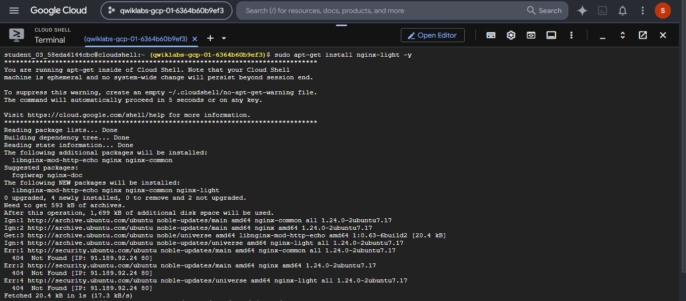
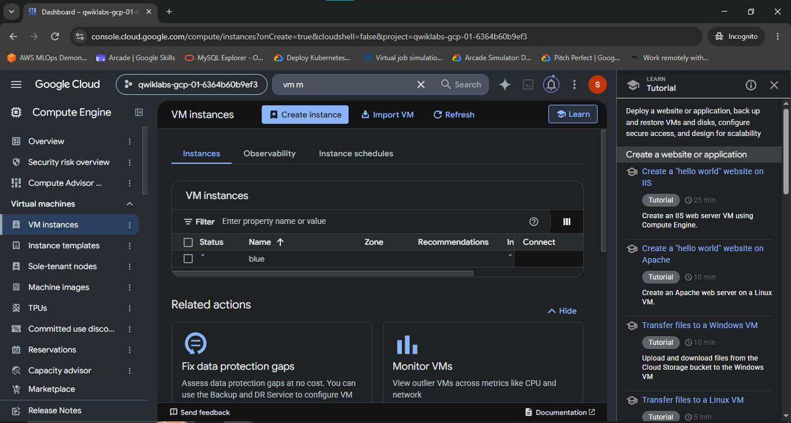
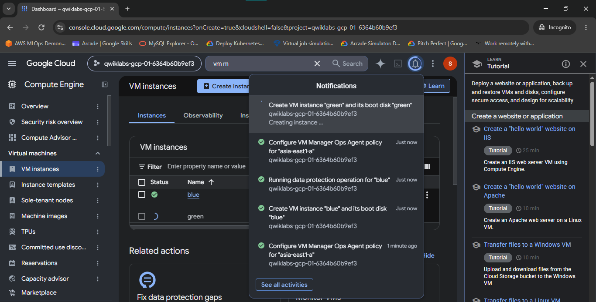
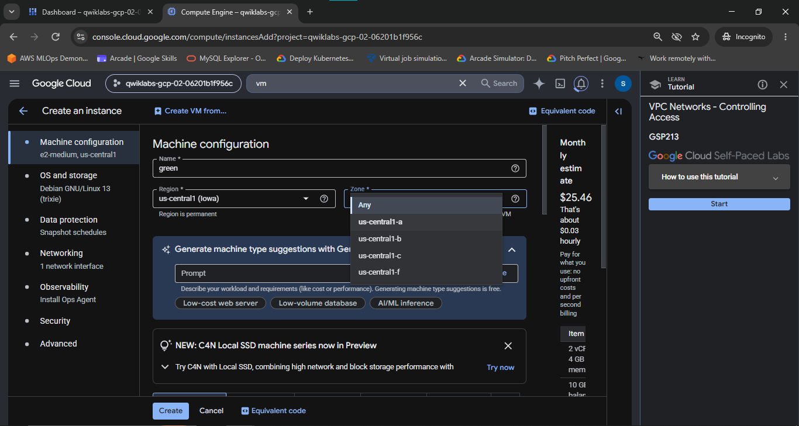
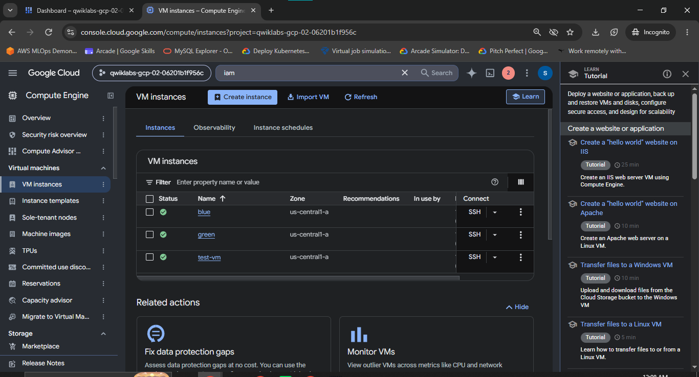
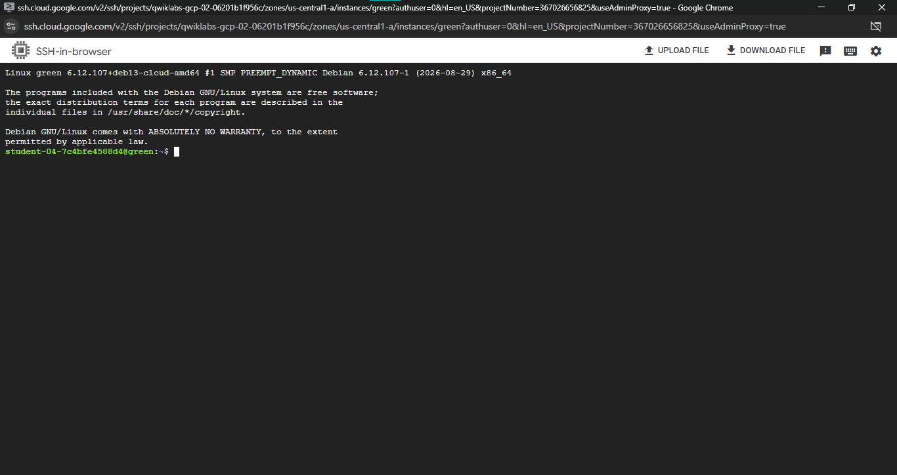
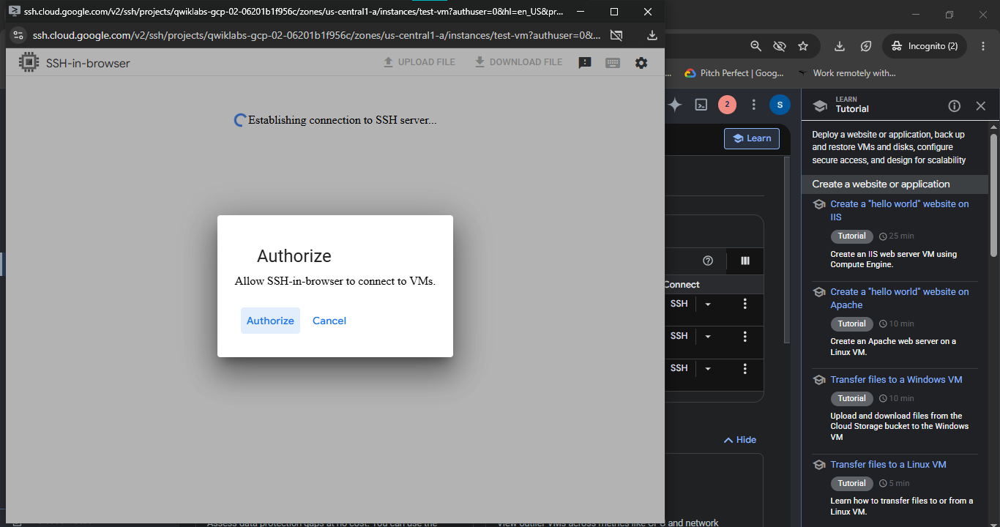
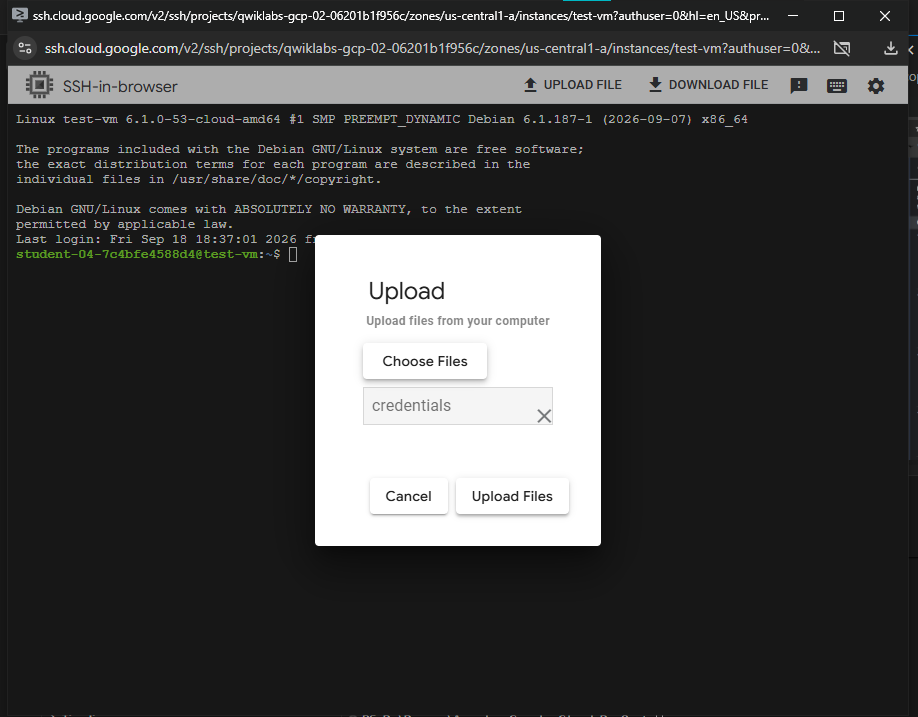
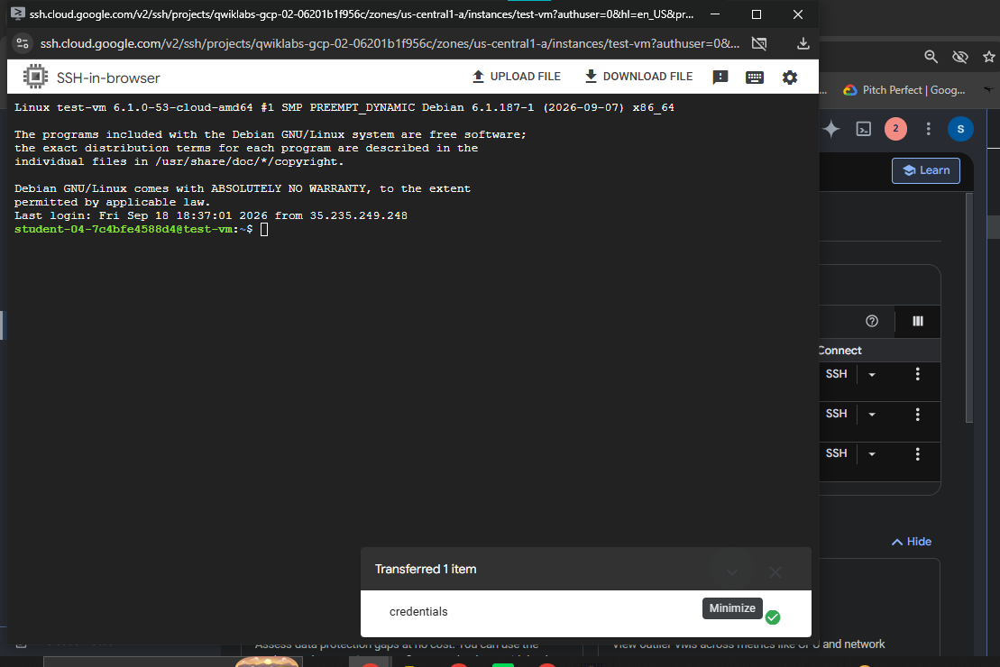

# VPC Networks - Controlling Access

A comprehensive Google Cloud Networking & Security portfolio document detailing Virtual Private Cloud (VPC) ingress traffic control, network tag filtering, custom nginx web server configuration across Compute Engine VM instances, firewall rule evaluation, service account provisioning, and IAM role delegation (Compute Network Admin vs Compute Security Admin).

---

## Lab Information

| Field | Details |
|---|---|
| **Lab Name** | VPC Networks - Controlling Access |
| **Lab ID** | GSP213 |
| **Platform** | Google Cloud Platform (GCP) / Qwiklabs |
| **Difficulty** | Intermediate |
| **Domain** | Cloud Security & VPC Networking |
| **Status** | In Progress / Setup Verified |

---

## Overview

In enterprise Google Cloud architectures, securing compute instances against unauthorized ingress traffic requires fine-grained firewall rules combined with Virtual Private Cloud (VPC) network tags and Identity and Access Management (IAM) privilege controls.

This lab demonstrates how to control network access between Compute Engine instances residing within the same VPC network. Two web server instances (`blue` and `green`) are provisioned with custom nginx welcome pages. By attaching a specific network tag (`web-server`) to `blue` while omitting it from `green`, targeted ingress firewall rules are applied to permit HTTP (TCP port 80) traffic exclusively to tagged instances. 

Furthermore, access control responsibilities are delegated using specialized IAM roles—distinguishing between the privileges of **Compute Network Admin** and **Compute Security Admin**.

---

## Network Architecture & Traffic Flow

```text
                                  Google Cloud VPC (default)
                                              |
     +----------------------------------------+----------------------------------------+
     |                                        |                                        |
  blue VM                                  green VM                                 test-vm
(us-central1-a)                          (us-central1-a)                          (us-central1-a)
Tag: web-server                          Tag: None                                Tag: None
  |                                        |                                        |
  | (nginx server)                         | (nginx server)                         | (Client / Curl)
  |                                        |                                        |
  +<--- ALLOW (TCP 80 & ICMP) --------------+----------------------------------------+
  |     Firewall: allow-http-web-server    |
  |     Target Tag: web-server             |
  |                                        |
  + - - - BLOCKED (Connection Timeout) - - +
```

---

## Technical Specifications

### 1. Compute Engine Instance Inventory

| Instance Name | Zone | Machine Type | Operating System | Network Tag | Role / Customization |
|---|---|---|---|---|---|
| `blue` | `us-central1-a` | `e2-medium` / `e2-micro` | Debian GNU/Linux 12 | `web-server` | Primary web server (`Welcome to the blue server!`) |
| `green` | `us-central1-a` | `e2-medium` / `e2-micro` | Debian GNU/Linux 12 | *None* | Secondary web server (`Welcome to the green server!`) |
| `test-vm` | `us-central1-a` | `e2-micro` | Debian GNU/Linux 12 | *None* | Testing client for HTTP & ICMP reachability |

### 2. Ingress Firewall Policy Specifications

| Firewall Rule Name | Network | Direction | Action | Priority | Target Tags | Source Range | Protocols & Ports |
|---|---|---|---|---|---|---|---|
| `allow-http-web-server` | `default` | Ingress | Allow | 1000 | `web-server` | `0.0.0.0/0` | `tcp:80`, `icmp` |

---

## Environment Triage & Common Pitfalls

> [!WARNING]
> **Cloud Shell vs. Compute Engine VM SSH Terminal Isolation**
> 
> A common configuration mistake is executing package installation commands inside **Google Cloud Shell** instead of SSHing directly into the target VM instances (`blue` or `green`).
> 
> Cloud Shell runs on a restricted, ephemeral Debian container host. Attempting to run `apt-get install nginx-light` in Cloud Shell yields `404 Not Found` errors because apt repository mirrors are not configured for full package updates inside Cloud Shell.


*Figure 1: Package installation failure when erroneously executing `apt-get` inside Cloud Shell (`@cloudshell`) instead of the VM SSH terminal.*

---

## Step-by-Step Implementation & Verification

### Task 1 — Provision Web Server VM Instances (`blue` & `green`)

#### 1. Create the `blue` VM Instance
- **Name**: `blue`
- **Zone**: `us-central1-a`
- **Networking Tag**: `web-server`


*Figure 2: Provisioning the `blue` VM instance within the Google Cloud Console.*


*Figure 3: Console notification confirming successful creation of boot disk and VM instance `blue`.*

#### 2. Create the `green` VM Instance
- **Name**: `green`
- **Zone**: `us-central1-a`
- **Networking Tag**: *None* (Left empty deliberately to test tag-based firewall filtering)


*Figure 4: Configuring the `green` VM instance in zone `us-central1-a` under lab GSP213.*


*Figure 5: Compute Engine VM Instances dashboard confirming `blue`, `green`, and `test-vm` running in `us-central1-a`.*

#### 3. Install & Customize nginx on `blue` VM

Open an SSH session to `blue` VM from the Google Cloud Console and execute:

```bash
# 1. Update repository index and install nginx-light
sudo apt-get update && sudo apt-get install nginx-light -y

# 2. Non-interactive string replacement for nginx welcome heading
sudo sed -i 's/Welcome to nginx!/Welcome to the blue server!/g' /var/www/html/index.nginx-debian.html

# 3. Verify HTML heading modification
grep '<h1>' /var/www/html/index.nginx-debian.html
```

**Expected Verification Output:**
```html
<h1>Welcome to the blue server!</h1>
```

#### 4. Install & Customize nginx on `green` VM

Open an SSH session to `green` VM from the Google Cloud Console:


*Figure 6: Browser-based SSH terminal session active on `green` VM instance (`student-...@green:~$`).*

Execute the non-interactive setup on `green`:

```bash
# 1. Update package index and install nginx-light
sudo apt-get update && sudo apt-get install nginx-light -y

# 2. Update welcome heading for green server
sudo sed -i 's/Welcome to nginx!/Welcome to the green server!/g' /var/www/html/index.nginx-debian.html

# 3. Verify HTML heading modification
grep '<h1>' /var/www/html/index.nginx-debian.html
```

**Expected Verification Output:**
```html
<h1>Welcome to the green server!</h1>
```

---

### Task 2 — Configure Ingress Firewall Policy & Test Reachability

#### 1. Create Ingress Firewall Rule (`allow-http-web-server`)

To grant external and internal HTTP access exclusively to instances tagged with `web-server`, execute the following `gcloud` command or configure via Cloud Console:

```bash
gcloud compute firewall-rules create allow-http-web-server \
    --network=default \
    --direction=INGRESS \
    --action=ALLOW \
    --rules=tcp:80,icmp \
    --source-ranges=0.0.0.0/0 \
    --target-tags=web-server
```

#### 2. Provision Test Instance (`test-vm`)
- **Name**: `test-vm`
- **Zone**: `us-central1-a`
- **Machine Type**: `e2-micro`


*Figure 7: SSH-in-browser Authorization prompt when connecting to `test-vm`.*


*Figure 8: Transferring service account credentials to `test-vm` via SSH browser interface.*


*Figure 9: SSH terminal confirmation of completed credential transfer on `test-vm`.*

#### 3. Test HTTP & ICMP Reachability from `test-vm`

From the SSH session inside `test-vm`, curl the internal IP addresses of `blue` and `green`:

```bash
# Test reachability to blue VM (Tagged: web-server)
curl http://<BLUE_INTERNAL_IP>
```

**Result**: Succeeds! Returns response containing `<h1>Welcome to the blue server!</h1>`.

```bash
# Test reachability to green VM (Untagged)
curl --connect-timeout 5 http://<GREEN_INTERNAL_IP>
```

**Result**: Fails with connection timeout (`curl: (28) Failed to connect to <GREEN_INTERNAL_IP> port 80: Connection timed out`). This proves that the firewall rule `allow-http-web-server` correctly filters traffic based on network tags.

---

### Task 3 — IAM Roles: Network Admin vs. Security Admin

Google Cloud enforces Principle of Least Privilege through distinct networking IAM roles:

| IAM Role | Role ID | Firewall Management | Subnet & Route Management |
|---|---|---|---|
| **Compute Network Admin** | `roles/compute.networkAdmin` | ❌ Denied | ✅ Allowed |
| **Compute Security Admin** | `roles/compute.securityAdmin` | ✅ Allowed | ❌ Denied |

#### 1. Create Service Account `Network-admin`
```bash
gcloud iam service-accounts create network-admin \
    --display-name="Network Admin Service Account"
```

#### 2. Test Firewall Operations under Compute Network Admin
When authenticated as `Network-admin` with `roles/compute.networkAdmin`, attempting to delete or modify a firewall rule returns an authorization error:

```text
ERROR: (gcloud.compute.firewall-rules.delete) Could not fetch resource:
 - Required 'compute.firewalls.delete' permission for 'projects/<PROJECT_ID>/global/firewalls/allow-http-web-server'
```

#### 3. Elevate to Compute Security Admin & Perform Teardown
Granting `roles/compute.securityAdmin` provides the requisite `compute.firewalls.delete` permission, enabling successful deletion of `allow-http-web-server`:

```bash
gcloud compute firewall-rules delete allow-http-web-server --quiet
```

---

## Empirical Evidence Proof Matrix

| Figure | Image Asset Path | Lab Objective / Verification Proof | Status |
|---|---|---|---|
| **Fig. 1** | [`01-cloudshell-apt-error.png`](./Screenshot/01-cloudshell-apt-error.png) | Demonstrates Cloud Shell environment check & package install error | Verified |
| **Fig. 2** | [`02-vm-creation-blue.png`](./Screenshot/02-vm-creation-blue.png) | Evidence of `blue` VM configuration in GCP Console | Verified |
| **Fig. 3** | [`03-vm-creation-notifications.png`](./Screenshot/03-vm-creation-notifications.png) | GCP Notifications proving `blue` disk and VM creation | Verified |
| **Fig. 4** | [`04-create-green-vm-gsp213.png`](./Screenshot/04-create-green-vm-gsp213.png) | GCP Console form creating `green` VM under GSP213 lab context | Verified |
| **Fig. 5** | [`07-vm-instances-list.png`](./Screenshot/07-vm-instances-list.png) | Active VM instance list (`blue`, `green`, `test-vm` in `us-central1-a`) | Verified |
| **Fig. 6** | [`05-ssh-green-vm.png`](./Screenshot/05-ssh-green-vm.png) | SSH terminal prompt connected to `green` VM instance | Verified |
| **Fig. 7** | [`06-ssh-authorize-test-vm.png`](./Screenshot/06-ssh-authorize-test-vm.png) | SSH browser connection modal for `test-vm` | Verified |
| **Fig. 8** | [`08-ssh-test-vm-upload.png`](./Screenshot/08-ssh-test-vm-upload.png) | File upload dialog transferring credentials to `test-vm` | Verified |
| **Fig. 9** | [`09-ssh-test-vm-transferred.png`](./Screenshot/09-ssh-test-vm-transferred.png) | Completed file transfer dialog inside `test-vm` SSH session | Verified |

---

## Key Learnings & Engineering Principles

1. **Network Tag-Based Security Boundary**: Ingress firewall rules targeting network tags enforce micro-segmentation without needing dedicated subnet boundaries for every service tier.
2. **Non-Interactive System Configuration**: Utilizing `sed` for string substitution prevents shell blockages in headless CI/CD automation pipelines and avoids reliance on interactive terminal editors like Nano.
3. **IAM Least Privilege Separation**: Network topology maintenance (Subnets, Routes) and Network Security Policy maintenance (Firewalls, SSL policies) are strictly segregated between `compute.networkAdmin` and `compute.securityAdmin` roles.
